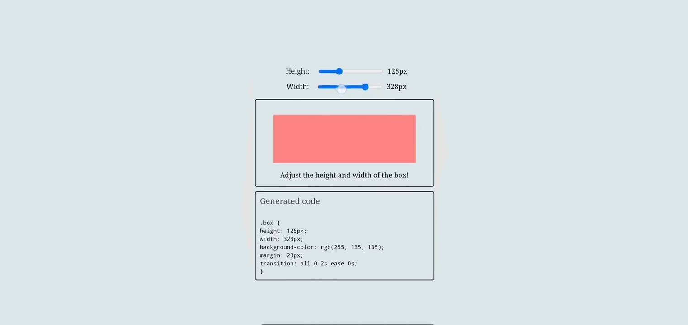

# generate Box Project

🚀 Welcome to the Resizable Box project! 📦

This project showcases a responsive and interactive resizable box implemented using HTML, CSS, and JavaScript. Easily adjust the box dimensions with the provided sliders, and explore the generated CSS code.

## Features

- Dynamic resizing of the box using sliders.
- Real-time update of CSS code reflecting changes.
- Clean and organized code structure.

## How to Use

1. Clone the repository.
2. Open the `index.html` file in your browser.
3. Use the height and width sliders to resize the box.
4. Explore the generated CSS code in real-time.

## Preview

## Technologies Used

- HTML
- CSS
- JavaScript

## Contributing

Feel free to contribute by opening issues or creating pull requests. Your feedback is highly appreciated!

Happy Coding! 👩‍💻👨‍💻
